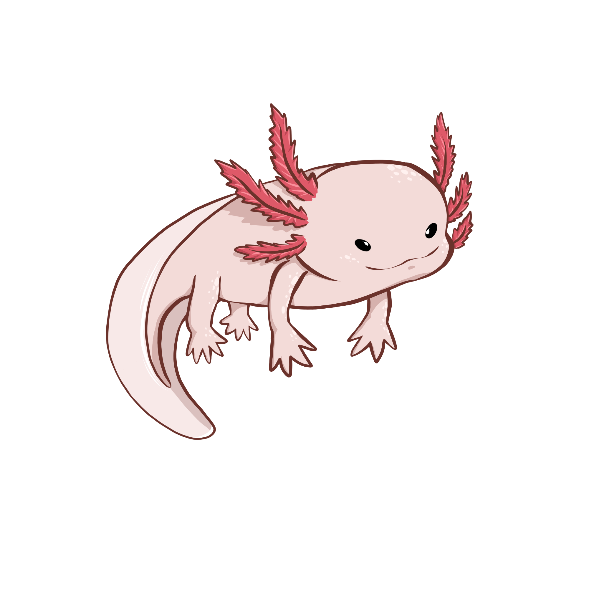

<h1 align="center">
   <br/>
    
   </br/>
    Aleks Bot
</h1>
<h4 align="center">A professional discord bot for a professional discord server.</h4>
<h5 align="center">Modulable, open-source, powerful, moderation, fun, socials, etc.</h5>


<p align="center">
  <a href="https://discord.gg/RvjSrJD5mj">
    
  </a>
  <a href="https://github.com/Nihlus/Remora.Discord">
     
  </a>
  </a>
</p>
<details open="open">
  <summary>Table of Contents</summary>
  <ol>
    <li>
      <a href="#about-the-project">About The Project</a>
    </li>
    <li>
      <a href="#getting-started">Getting Started</a>
      <ul>
        <li><a href="#prerequisites">Prerequisites</a></li>
        <li><a href="#installation">Installation</a></li>
      </ul>
    </li>
    <li><a href="#usage">Usage</a></li>
    <li><a href="#roadmap">Roadmap</a></li>
    <li><a href="#contributing">Contributing</a></li>
    <li><a href="#license">License</a></li>
  </ol>
</details>

## About The Project

Aleks-Bot is a discord bot primarily designed for the Talent Hub discord server. It is a bot that is open-source and modulable. It is also a bot that is designed to be powerful, fun, moderation, socials, etc.
It is lovely powered with [Remora.Discord 🦈](https://github.com/Remora/Remora.Discord) by [Nihlus](https://github.com/Nihlus).
The first goal of this bot is to fill the needs of the Talent Hub discord server, but it can be used for other servers.
We are looking to add more features to the bot, and we are open to suggestions.

## Getting Started

To get a local copy up and running follow these simple steps.

### Prerequisites

You need to have the following software installed on your computer:

* [.NET 7.0 SDK](https://dotnet.microsoft.com/download/dotnet/7.0)

### Installation

1. Clone the repo
   ```sh
   $ git clone https://github.com/TalentHubDiscord/Aleks-Bot.git
   ```
2. Change directory
   ```sh
   $ cd Aleks-Bot
   ```

3. Change directory to the worker
   ```sh
   $ cd RemoraDiscordBot.Worker
   ```

4. Install the dependencies
   ```sh
    $ dotnet restore
    ```

5. Init the user secrets
   ```sh
    $ dotnet user-secrets init
    ```
   
6. While in development, you need to specify your guild id, otherwise the slash commands won't load quickly
   ```sh
   $ dotnet user-secrets set "Discord:GUILD_ID_" "YOUR_GUILD_ID"
   ```

7. Add your bot token
   ```sh
   $ dotnet user-secrets set "Discord:BotToken" "YourBotToken"
   ```
   
8. And finally, add the connectionString to the database (MySQL)
   ````sh
   $ dotnet user-secrets set "ConnectionStrings:DefaultConnection" "YourConnectionString"
   ````
   
9. The project's using Entity Framework Core, so you need to run the migrations
   ```sh
   $ dotnet ef database update --project ../RemoraDiscordBot.Data
   ```

*note: You can find any connection string you want [here](https://www.connectionstrings.com/).*

## Usage

After inviting the bot to your server, you can use the slash commands to interact with the bot.
You can see every features of the bot by checking all the files inside the `RemoraDiscordBot.Plugins` folder.

## Roadmap

- [x] Link the bot to a database
- [x] Link the [Creatures API](https://github.com/TalentHubDiscord/My-Fabulous-Creatures-API) to the bot
- [x] Implement the advertisement guard feature, to prevent users from advertising other servers.
- [x] Implement the experience system, to reward users for their activity, with the creatures api.
- [x] Implement the personal vocal system, every user can create a personal vocal channel.
- [x] Implement the welcomer system, to welcome new users.
- [ ] Implement a command to modify the guild welcomer message with placeholder. "Welcome {user} to {guild}!"
- [ ] Optimize experience feature's queries to the database, with a cache system.
- [ ] Batch the experience feature's queries to the database, to prevent spamming the database.
- [ ] Maybe use RabbitMQ to batch the experience feature's queries to the database.
- [ ] Create a ticket system, to allow users to create a ticket to contact the staff.
- [ ] User can check bot's information only by mentioning the bot.
- [ ] Paginate the experience's feature's leaderboard command. (Use the [Remora Discord Pagination feature](https://github.com/Remora/Remora.Discord/blob/main/Remora.Discord.Pagination/README.md))
- [ ] Add permission checks to the commands.
- [ ] Add a command to check the bot's latency.
- [ ] Implement a birthday system, to allow users to set their birthday and to be notified on their birthday. (Create role, make an API to get the birthdays, etc.)

Eventually, I would like to create a website to manage the bot, with a dashboard, and a panel to manage the bot's settings.

## Contributing

Contributions are what make the open source community such an amazing place to be learn, inspire, and create. Any contributions you make are **greatly appreciated**.
This web API is pretty simple, but it can be improved. If you want to contribute, you can do it by opening an issue or by creating a pull request.
**__#first-contributions-friendly__**

1. Fork the Project
2. Create your Feature Branch (`git checkout -b feature/BirthdaySystem`)
3. Commit your Changes (`git commit -m 'Add some BirthdaySystem'`)
4. Push to the Branch (`git push origin feature/BirthdaySystem`)
5. Open a Pull Request
6. Wait for the review

## License

Distributed under the MIT License. See `LICENSE` for more information.

